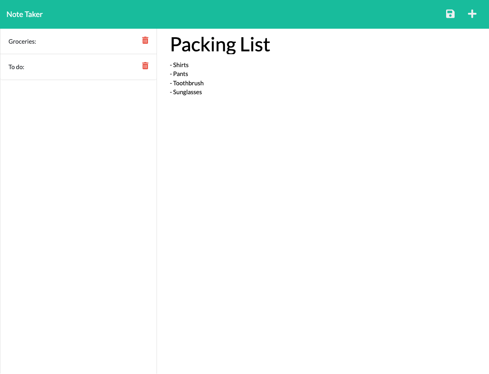

# 11 Express.js Note Taking App

## Description:

My express.js note taking app allows users to create notes, and save them. Once the user opens the app, in the top right hand corner is a "+" button where they will click to start a new note. Once they enter both title and body text, a save button in the top right will appear which is what the user will click to save thier note once they are done editing.

They can then open previous notes to read in the list of notes on the lefthand side.

## Screenshot

## Links

- Here is my deployed application: [herokuapp.com/notes](https://express-note-taking-app-ge.herokuapp.com/notes)
- Here is my repo: [gwenewasko/repo](https://github.com/gwenewasko/Express.js-Note-Taking-App--HW11)
